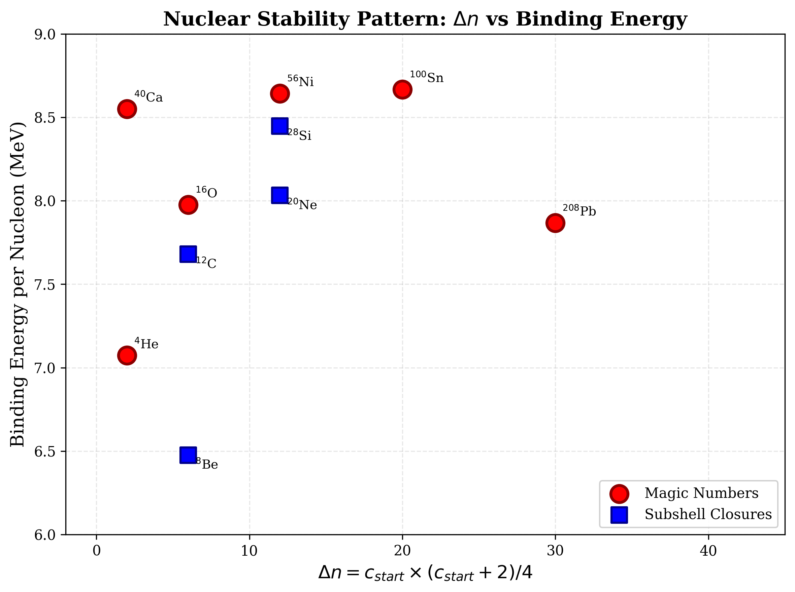
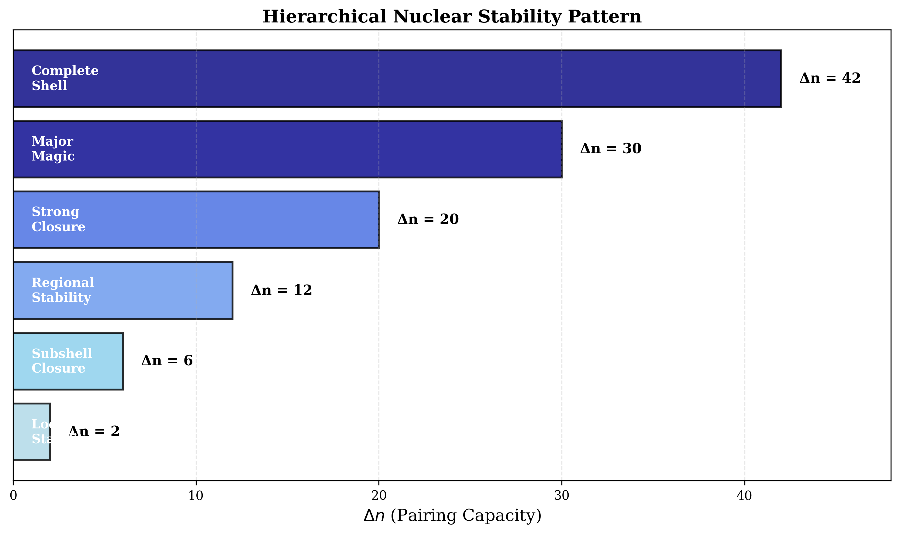
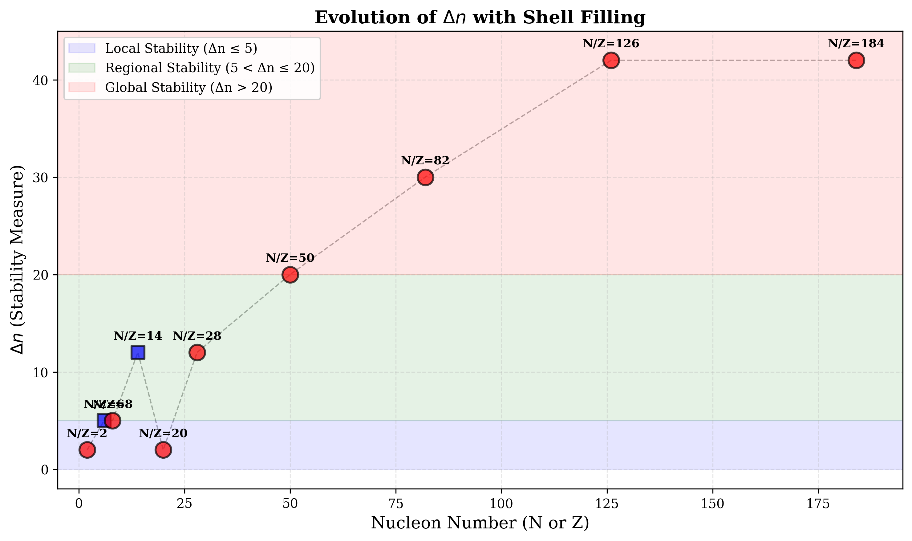
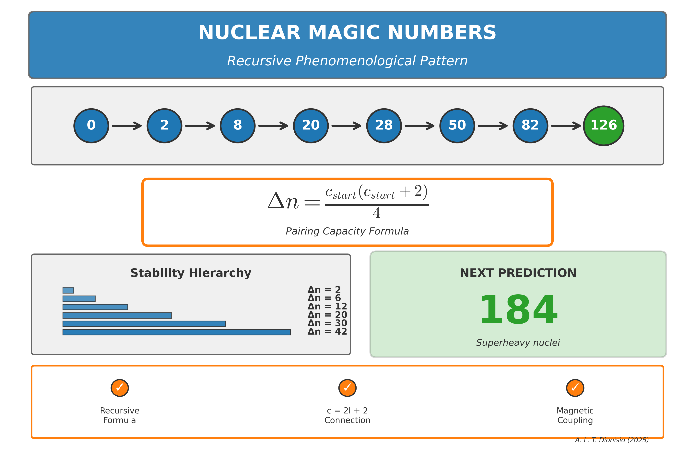

# Nuclear Magic Numbers: Phenomenological Pattern

[](https://opensource.org/licenses/MIT)
[]()
[]()
[](https://www.python.org/)

A phenomenological recursive formula that reproduces all known nuclear magic numbers (2, 8, 20, 28, 50, 82, 126) and predicts **184** as the next magic number in superheavy nuclei.

## 🎯 Key Features

- **Recursive Formula**: Complete pattern from first principles
- **Three Parameters**: `c_start`, `c_high-j`, and `Δn`
- **Quantum Connection**: Links to `c = 2l + 2`
- **Prediction**: 184 for superheavy elements
- **Hierarchical Stability**: Six levels of `Δn` (2, 6, 12, 20, 30, 42)
- **Educational Value**: Accessible framework for nuclear physics

## 📐 The Formula

The recursive formula is based on three fundamental relationships:

```
Δn = c_start × (c_start + 2) / 4
C_total = Δn + c_high-j
M_{n+1} = M_n + C_total
```

Where:
- `Δn`: Number of particles filling by decreasing even numbers
- `c_start`: Starting value for the decreasing sequence
- `c_high-j`: High-j orbital contribution
- `M_n`: Current magic number
- `M_{n+1}`: Next magic number

## 🚀 Quick Start

### Installation

```bash
pip install numpy matplotlib
```

### Usage

#### Interactive Calculator

```bash
python src/calculator/magic_number_calculator.py
```

#### Generate Figures

```bash
python src/visualization/generate_figures.py
```

#### Generate Graphic Abstract

```bash
python src/visualization/generate_graphic_abstract.py
```

## 📊 Validation

| M_n | c_start | c_high-j | Δn | M_{n+1} | Status |
|-----|---------|----------|----|---------| -------|
| 0   | 0       | 2        | 0  | **2**   | ✓ Validated |
| 2   | 2       | 4        | 2  | **8**   | ✓ Validated |
| 8   | 4       | 6        | 6  | **20**  | ✓ Validated |
| 20  | 2       | 6        | 2  | **28**  | ✓ Validated |
| 28  | 6       | 10       | 12 | **50**  | ✓ Validated |
| 50  | 8       | 12       | 20 | **82**  | ✓ Validated |
| 82  | 10      | 14       | 30 | **126** | ✓ Validated |
| 126 | 12      | 16       | 42 | **184** | 🔮 Predicted |

**Accuracy**: 100% for all known magic numbers (2, 8, 20, 28, 50, 82, 126)

## 📚 Documentation

- [Quick Reference Guide](docs/QUICK_REFERENCE_GUIDE.txt) - Fast overview of the pattern
- [Python Scripts Guide](docs/PYTHON_SCRIPTS_GUIDE.txt) - How to use the code
- [Submission Instructions](docs/SUBMISSION_INSTRUCTIONS.txt) - Publication guidelines
- [Presentation Slides](resources/presentation_slides.md) - 33 slides explaining the theory
- [Executive Summary](resources/EXECUTIVE_SUMMARY.txt) - Key findings summary

## 📖 Paper

The full paper is available in the `paper/` directory:
- [Main Article (PDF)](paper/main/magic_numbers_main.pdf) - Core theory and validation
- [Supplementary Material (PDF)](paper/supplementary/magic_numbers_supplementary.pdf) - Extended analysis
- [LaTeX Sources](paper/main/) - Source files for reproduction

**Preprint**: [Coming soon on arXiv]

## 🔬 Key Discoveries

This work presents four major discoveries:

1. **[Decreasing Sequence Pattern](discoveries/DECREASING_SEQUENCE_PATTERN.txt)**
   - All nuclear shells fill by decreasing even-number sequences
   - Universal pattern: shells close when Δn particles are added

2. **[Hierarchical Stability Levels](discoveries/DECREASING_SEQUENCE_PATTERN.txt)**
   - Six universal stability levels: Δn = 2, 6, 12, 20, 30, 42
   - Forms arithmetic progression with second difference = 2

3. **[Quantum Connection c = 2l + 2](discoveries/C_EQUALS_2L_PLUS_2_HIGHLIGHT.txt)**
   - Phenomenological parameter c linked to angular momentum
   - Bridges shell model and phenomenology

4. **[Magnetic Coupling Ratio](discoveries/MAGNETIC_COUPLING_ADDITION.txt)**
   - |μ_p/μ_n| ≈ 1.46 matches N/Z ratio in heavy stable nuclei
   - Suggests deeper symmetry in nuclear structure

## 💻 Code Examples

### Calculate Next Magic Number

```python
from src.calculator.magic_number_calculator import calculate_next_magic

# Calculate next magic number after 82
M_next = calculate_next_magic(M_n=82, c_start=10, c_high_j=14)
print(f"Next magic number: {M_next}")  # Output: 126

# Predict superheavy magic number
M_superheavy = calculate_next_magic(M_n=126, c_start=12, c_high_j=16)
print(f"Superheavy magic number: {M_superheavy}")  # Output: 184
```

### Generate All Magic Numbers

```python
magic_numbers = [0, 2, 8, 20, 28, 50, 82, 126]
parameters = [
    (0, 2), (2, 4), (4, 6), (2, 6), (6, 10), (8, 12), (10, 14), (12, 16)
]

for i, (c_start, c_high_j) in enumerate(parameters[:-1]):
    M_n = magic_numbers[i]
    delta_n = c_start * (c_start + 2) // 4
    C_total = delta_n + c_high_j
    M_next = M_n + C_total
    print(f"M_{i} = {M_n} → M_{i+1} = {M_next} (Δn={delta_n}, c={c_start}→{c_high_j})")
```

## 🎓 Citation

If you use this work in your research, please cite:

```bibtex
@article{dionisio2025magic,
  title={A Phenomenological Pattern for Nuclear Magic Numbers: 
         Recursive Formula and Predictions for Superheavy Elements},
  author={Dionísio, André Luís Tomaz},
  journal={Preprints},
  year={2025},
  note={DOI pending}
}
```

## 📊 Figures

### Figure 1: Δn vs Binding Energy


### Figure 2: Stability Hierarchy


### Figure 3: Pattern Evolution


### Graphic Abstract


## 🛠️ Technical Details

### Requirements
- Python 3.7+
- NumPy
- Matplotlib

### Installation

```bash
git clone https://github.com/AndreDionisio/nuclear-magic-numbers-pattern.git
cd nuclear-magic-numbers-pattern
pip install -r requirements.txt
```

### Testing

All calculations are verified against experimental data:
- Shell closures: Z, N = 2, 8, 20, 28, 50, 82, 126
- Binding energy per nucleon peaks
- Nuclear stability patterns

## 📄 License

This project is licensed under the MIT License - see the [LICENSE](LICENSE) file for details.

### MIT License Summary
- ✅ Commercial use
- ✅ Modification
- ✅ Distribution
- ✅ Private use
- ⚠️ Liability and warranty disclaimer

## 👤 Author

**André Luís Tomaz Dionísio**

- 🏛️ Institution: EPHEC Brussels, Belgium
- 📧 Email: andreluisdionisio@gmail.com
- 🔬 ORCID: [0009-0006-4648-3804](https://orcid.org/0009-0006-4648-3804)
- 💻 GitHub: [@AndreDionisio](https://github.com/AndreDionisio)

## 🙏 Acknowledgments

This research was developed during studies at EPHEC Brussels with support from the academic environment that enabled this theoretical investigation into nuclear structure.

## 🤝 Contributing

Contributions are welcome! Areas for collaboration:

- Experimental validation with superheavy elements
- Extension to deformed nuclei
- Connection to shell model calculations
- Educational applications
- Code optimization and new visualizations

Please open an issue or submit a pull request.

## 📬 Contact

For questions, suggestions, or collaborations:
- 📧 Email: andreluisdionisio@gmail.com
- 💬 GitHub Issues: [Open an issue](https://github.com/AndreDionisio/nuclear-magic-numbers-pattern/issues)

## 📈 Project Status

- ✅ **Theory**: Complete and validated
- ✅ **Code**: Functional and documented
- ✅ **Paper**: Ready for submission
- 🔄 **Publication**: Preprint pending
- 🌟 **Collaboration**: Open

## 🔗 Related Resources

- [Nuclear Data from IAEA](https://www-nds.iaea.org/)
- [National Nuclear Data Center](https://www.nndc.bnl.gov/)
- [Shell Model Overview](https://en.wikipedia.org/wiki/Nuclear_shell_model)

## 📅 Version History

- **v1.0.0** (December 2025) - Initial release
  - Complete theory and validation
  - Python implementation
  - Full documentation
  - Paper ready for submission

---

<div align="center">

**Status**: 🚀 Ready for publication | 📝 Preprint pending | 🔬 Open for collaboration

Made with ❤️ for nuclear physics

[Report Bug](https://github.com/AndreDionisio/nuclear-magic-numbers-pattern/issues) · 
[Request Feature](https://github.com/AndreDionisio/nuclear-magic-numbers-pattern/issues) · 
[Documentation](docs/)

</div>
